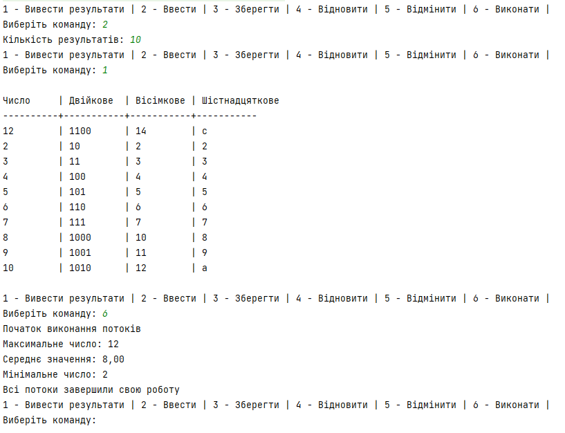
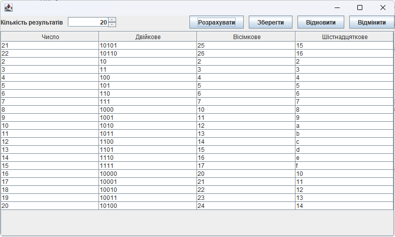
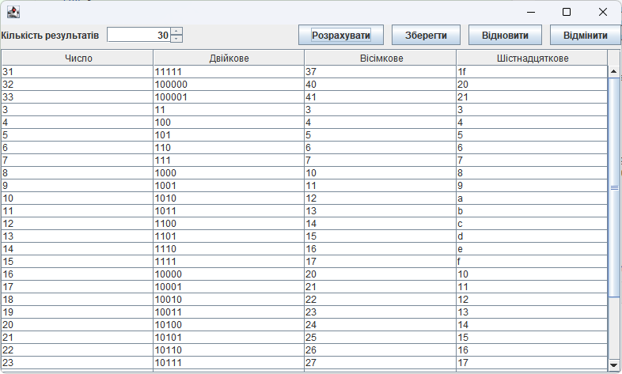
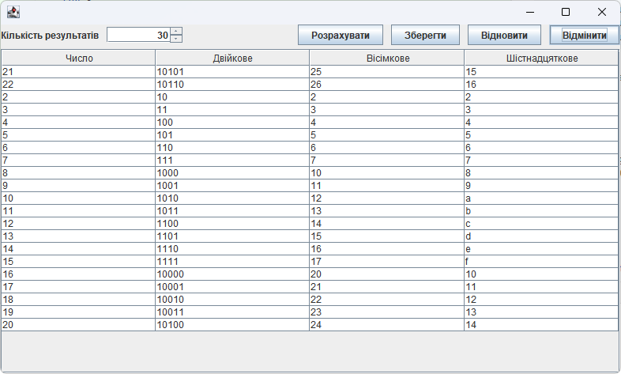

## Завдання 1
Написати просту консольну програму
```java
class Main {
    public static void main(String[] args) {
        System.out.println("Hello World!");
    }
}
```

## Завдання 2
Індивідуальне завдання: Знайти двійкове, вісімкове та шістнадцяткове уявлення цілочисленного
значення.
1. Розробити клас, що серіалізується, для зберігання параметрів і результатів
обчислень.
Використовуючи агрегування, розробити клас для знаходження рішення
задачі. 
2. Розробити клас для демонстрації в діалоговому режимі збереження та
відновлення стану об'єкта, використовуючи серіалізацію. Показати особливості
використання transient полів. 
3. Розробити клас для тестування коректності результатів обчислень та
серіалізації/десеріалізації.

Main.java

```java
package ex02;

import java.io.IOException;
import java.util.Scanner;

public class Main {
    public static void main(String[] args) throws IOException {
        Scanner sc = new Scanner(System.in);
        Calc num = new Calc(0);
        boolean run = true;

        while (run) {
            System.out.println("1 - Задати число");
            System.out.println("2 - Двійкове представлення");
            System.out.println("3 - Вісімкове представлення");
            System.out.println("4 - Шістнадцяткове представлення");
            System.out.println("5 - Серіалізувати");
            System.out.println("6 - Десеріалізувати");
            System.out.println("7 - Вийти");
            System.out.print("\nВиберіть функцію: ");

            String selected = sc.nextLine();

            switch (selected) {
                case "1":
                    System.out.println("Введіть число: ");
                    num.setNumber(sc.nextInt());
                    break;
                case "2":
                    System.out.println("Двійкове представлення числа " + num.getNumber() + ": " + num.getBinRepresentation());
                    break;
                case "3":
                    System.out.println("Вісімкове представлення числа " + num.getNumber() + ": " + num.getOctRepresentation());
                    break;
                case "4":
                    System.out.println("Шістнадцяткове представлення числа " + num.getNumber() + ": " + num.getHexRepresentation());
                    break;
                case "5":
                    num.serialize();
                    System.out.println("Клас серіалізовано");
                    break;
                case "6":
                    try {
                        num = Calc.deserialize();
                    } catch (IOException | ClassNotFoundException e) {
                        System.out.println("Помилка десеріалізації");
                    }
                    break;
                case "7":
                    run = false;
            }
        }
    }
}
```

Calc.java
```java
package ex02;

import java.io.Serializable;
import java.io.IOException;
import java.io.FileOutputStream;
import java.io.FileInputStream;
import java.io.ObjectOutputStream;
import java.io.ObjectInputStream;


/**
 * Клас який повертає число у двійковому, вісімковому та шістнадцятковому уявленні
 *
 * @author Таїсія деркач
 */
public class Calc implements Serializable {
    private int number;
    private transient String binRepresentation;
    private transient String octRepresentation;
    private transient String hexRepresentation;

    /**
     * Ініціалізація класу {@link Calc}
     * @param number число представлення якого будуть видаватися
     */
    public Calc(int number) {
        this.number = number;
    }

    /**
     * Розрахування числа для кожного із представлень
     */
    private void calculateRepresentations() {
        binRepresentation = Integer.toBinaryString(this.number);
        octRepresentation = Integer.toOctalString(this.number);
        hexRepresentation = Integer.toHexString(this.number);
    }

    /**
     * Зміна числа представлення якого будуть видаватися
     */
    public void setNumber(int number) {
        this.number = number;
        calculateRepresentations();
    }

    /**
     * Повертає число представлення якого будуть видаватися
     */
    public int getNumber() {
        return this.number;
    }

    /**
     * Повертає значення у двійковому форматі
     */
    public String getBinRepresentation() {
        if (binRepresentation == null) {
            calculateRepresentations();
        }

        return binRepresentation;
    }

    /**
     * Повертає значення у вісімковому форматі
     */
    public String getOctRepresentation() {
        if (octRepresentation == null) {
            calculateRepresentations();
        }

        return octRepresentation;
    }

    /**
     * Повертає значення у шістнадцятковому форматі
     */
    public String getHexRepresentation() {
        if (hexRepresentation == null) {
            calculateRepresentations();
        }

        return hexRepresentation;
    }

    /**
     * Серіалізує клас {@link Calc} в файл class.ser
     */
    public void serialize() throws IOException {
        FileOutputStream fos = null;
        ObjectOutputStream oos = null;

        try {
            fos = new FileOutputStream("src/ex02/class.ser");
            oos = new ObjectOutputStream(fos);

            oos.writeObject(this);
        } finally {
            if (fos != null) { fos.close(); }
            if (oos != null) { oos.close(); }
        }
    }

    /**
     * Десеріалізує клас {@link Calc} з файлу class.ser
     *
     * @return десеріалізований клас {@link Calc}
     */
    public static Calc deserialize() throws IOException, ClassNotFoundException {
        FileInputStream fis = null;
        ObjectInputStream ois = null;

        try {
            fis = new FileInputStream("src/ex02/class.ser");
            ois = new ObjectInputStream(fis);

            return (Calc) ois.readObject();
        } finally {
            if (fis != null) { fis.close(); }
            if (ois != null) { ois.close(); }
        }
    }
}
```

MainTest.java
```java
package ex01;

import ex02.Calc;
import org.junit.Test;

import java.io.IOException;

import static org.junit.Assert.assertEquals;
import static org.junit.Assert.assertNotNull;

/**
 * Тести для обчислень, серіалізації та десеріалізації
 *
 * @author Таїсія Деркач
 */
public class MainTest {
    /**
     * Тестування переведення числа в двійкове, вісімкове та шістнадцяткове представлення
     */
    @Test
    public void testCalc() {
        Calc number = new Calc(123);
        assertEquals("1111011", number.getBinRepresentation());
        assertEquals("173", number.getOctRepresentation());
        assertEquals("7b", number.getHexRepresentation());
    }

    /**
     * Тестування серіалізації та десеріалізації
     */
    @Test
    public void restore() throws IOException, ClassNotFoundException {
        Calc number = new Calc(123);

        number.serialize();

        Calc deserializedNumber = Calc.deserialize();

        assertNotNull(deserializedNumber);

        assertEquals("1111011", deserializedNumber.getBinRepresentation());
        assertEquals("173", deserializedNumber.getOctRepresentation());
        assertEquals("7b", deserializedNumber.getHexRepresentation());
    }
}

```
Результат:


# Завдання 3
1. Як основа використовувати вихідний текст проекту попередньої лабораторної роботи. Забезпечити розміщення результатів обчислень уколекції з можливістю збереження/відновлення.
2. Використовуючи шаблон проектування Factory Method (Virtual Constructor), розробити ієрархію, що передбачає розширення рахунок додавання
нових відображуваних класів.
3. Розширити ієрархію інтерфейсом "фабрикованих" об'єктів, що представляє набір методів для відображення результатів обчислень.
4. Реалізувати ці методи виведення результатів у текстовому виде.
5. Розробити тареалізувати інтерфейс для "фабрикуючого" методу.
   
Main.java
```java
package ex03;

import ex02.Calc;

import java.io.IOException;
import java.util.Scanner;

public class Main {

    /**
     * Об'єкт реалізуючий інтерфейс {@linkplain View}
     */
    private View view;

    /** Ініціалізує поле {@linkplain Main} */
    public Main(View view) {
        this.view = view;
    }

    /**
     * Відображення меню програми
     */
    protected void menu() throws IOException {
        Scanner sc = new Scanner(System.in);
        boolean run = true;

        while (run) {
            System.out.println("1 - Задати число");
            System.out.println("2 - Вивести представлення чисел");
            System.out.println("3 - Зберегти");
            System.out.println("4 - Відновити");
            System.out.println("5 - Вийти");
            System.out.print("\nВиберіть функцію: ");

            String selected = sc.nextLine();

            switch (selected) {
                case "1":
                    System.out.println("Введіть число: ");
                    view.viewInit(sc.nextInt());
                    break;
                case "2":
                    view.viewShow();
                    break;
                case "3":
                    view.viewSave();
                    System.out.println("Клас збережено");
                    break;
                case "4":
                    try {
                        view.viewRestore();
                    } catch (Exception e) {
                        System.out.println("Помилка відновлено");
                    }
                    break;
                case "5":
                    run = false;
            }
        }
    }

    public static void main(String[] args) throws IOException {
        Main main = new Main(new ViewableResult().getView());
        main.menu();
    }
}
```

View.java
```java
package ex03;

import ex02.Calc;

import java.io.IOException;
import java.util.ArrayList;

/** Шаблон проєктування Factory Method. Інтерфейс фабрикуємих об'єктів об'являє методи відображення об'єктів
 * @author Таїсія Деркач
 */
public interface View {
    /** Відображає заголовки */
    public void viewHeader();
    /** Відображає головну чатину */
    public void viewBody();
    /** Відображає закінчення */
    public void viewFooter();
    /** Відображає об'єкт цілком */
    public void viewShow();
    /** Виконує ініціалізацію */
    public void viewInit(int num);
    /** Повертає список елементів */
    public ArrayList<Calc> viewItems();
    /** Зберігає для майбутнього відновлення */
    public void viewSave() throws IOException;
    /** Відновлює раніше збережені дані */
    public void viewRestore() throws Exception;
}
```

Viewable.java
```java
package ex03;

interface Viewable {
    /** Створює об'єкт, реалізуючий {@link View} */
    public View getView();
}

```

ViewableResult.java
```java
package ex03;

public class ViewableResult implements Viewable {
    /**
     * Створює об'єкт, реалізуючий {@link View}
     */
    @Override
    public View getView() {
        return new ViewResult();
    }
}
```

ViewResult.java
```java
package ex03;

import ex02.Calc;

import java.io.*;
import java.util.ArrayList;

public class ViewResult implements View {
    private ArrayList<Calc> items = new ArrayList<Calc>();

    /**
     * Конструктор класу {@link ViewResult}
     */
    public ViewResult() {
        this(10);
    }

    /**
     * Конструктор класу  {@link ViewResult}
     *
     * @param num Кількість елементів
     */
    public ViewResult(int num) {
        this.viewInit(num);
    }

    /**
     * Відображає заголовки
     */
    @Override
    public void viewHeader() {
        System.out.println("Початок представлень");
    }

    /**
     * Відображає головну частину
     */
    @Override
    public void viewBody() {
        for (Calc calc : items) {
            System.out.println("Двійкове представлення числа " + calc.getNumber() + ": " + calc.getBinRepresentation());
            System.out.println("Вісімкове представлення числа " + calc.getNumber() + ": " + calc.getOctRepresentation());
            System.out.println("Шістнадцяткове представлення числа " + calc.getNumber() + ": " + calc.getHexRepresentation());
        }
    }

    /**
     * Відображає закінчення
     */
    @Override
    public void viewFooter() {
        System.out.println("Кінець представлень");
    }

    /**
     * Відображає об'єкт цілком
     */
    @Override
    public void viewShow() {
        viewHeader();
        viewBody();
        viewFooter();
    }

    /**
     * Виконує ініціалізацію
     *
     * @param num початок
     */
    @Override
    public void viewInit(int num) {
        items.clear();

        for (int i = 0; i < num; i++) {
            items.add(new Calc(0));
        }

        for (int i = 0; i < items.size(); i++) {
            items.get(i).setNumber(i + num + 1);
        }
    }

    /** Повертає список елементів */
    public ArrayList<Calc> viewItems() {
        return items;
    }

    /**
     * Зберігає для майбутнього відновлення
     */
    @Override
    public void viewSave() throws IOException {
        ObjectOutputStream objectOutputStream = new ObjectOutputStream(new FileOutputStream("src/ex03/view.ser"));
        objectOutputStream.writeObject(this.items);
    }

    /**
     * Відновлює раніше збережені дані
     */
    @Override
    public void viewRestore() throws Exception {
        ObjectInputStream objectInputStream = new ObjectInputStream(new FileInputStream("src/ex03/view.ser"));
        this.items = (ArrayList<Calc>) objectInputStream.readObject();
    }
}
```
Результат:


# Завдання 4
1.За основу використовувати вихідний текст проекту попередньої лабораторної роботи Використовуючи шаблон проектування Factory Method
(Virtual Constructor), розширити ієрархію похідними класами, реалізують методи для подання результатів у вигляді текстової
таблиці. Параметри відображення таблиці мають визначатися користувачем.
2.Продемонструвати заміщення (перевизначення, overriding), поєднання (перевантаження, overloading), динамічне призначення методів
(Пізнє зв'язування, поліморфізм, dynamic method dispatch).
3. Забезпечити діалоговий інтерфейс із користувачем.
4. Розробити клас для тестування основної функціональності.
5. Використати коментарі для автоматичної генерації документації засобами javadoc.

Main.java
```java
package ex04;

import ex03.View;

import java.io.IOException;
import java.util.Scanner;

public class Main {

    /**
     * Об'єкт реалізуючий інтерфейс {@linkplain View}
     */
    private View view;

    /** Ініціалізує поле {@linkplain Main} */
    public Main(View view) {
        this.view = view;
    }

    /**
     * Відображення меню програми
     */
    protected void menu() throws IOException {
        Scanner sc = new Scanner(System.in);
        boolean run = true;

        while (run) {
            System.out.print("1 - Задати число | ");
            System.out.print("2 - Вивести представлення чисел | ");
            System.out.print("3 - Зберегти | ");
            System.out.print("4 - Відновити | ");
            System.out.print("5 - Вийти\n");
            System.out.print("Виберіть функцію: ");

            int selected = sc.nextInt();
            System.out.println(" ");

            switch (selected) {
                case 1:
                    System.out.print("Введіть число: ");
                    view.viewInit(sc.nextInt());
                    break;
                case 2:
                    view.viewShow();
                    break;
                case 3:
                    view.viewSave();
                    System.out.println("Клас збережено");
                    break;
                case 4:
                    try {
                        view.viewRestore();
                    } catch (Exception e) {
                        System.out.println("Помилка відновлення");
                    }
                    break;
                case 5:
                    run = false;
            }
            System.out.println(" ");
        }
    }

    public static void main(String[] args) throws IOException {
        Main main = new Main(new ViewableTable().getView());
        main.menu();
    }
}
```
ViewTable.java
```java
package ex04;

import ex03.ViewResult;

/**
 * Клас для відображення результатів обчислень у вигляді таблиці
 */
public class ViewTable extends ViewResult {
    /**
     * Конструктор за замовчуванням
     */
    public ViewTable() {}

    /**
     * Відображає заголовки таблиці
     */
    @Override
    public void viewHeader() {
        System.out.printf("%-10s| %-10s| %-10s| %-10s\n", "Число", "Двійкове", "Вісімкове", "Шістнадцяткове");
    }

    /**
     * Відображає роздільник між заголовками та даними
     */
    public void separate() {
        System.out.println("-".repeat(10) + "+-" + "-".repeat(10) + "+-" + "-".repeat(10) + "+-" + "-".repeat(10));
    }

    /**
     * Відображає дані у вигляді таблиці
     */
    @Override
    public void viewBody() {
        for (int i = 1; i < viewItems().size(); i++) {
            System.out.printf("%-10s| %-10s| %-10s| %-10s\n", viewItems().get(i).getNumber(), viewItems().get(i).getBinRepresentation(), viewItems().get(i).getOctRepresentation(), viewItems().get(i).getHexRepresentation());
        }
    }

    /**
     * Відображає дані у вигляді таблиці з зовнішнього масиву
     *
     * @param data Масив даних для виведення
     */
    public void viewBody(String[][] data) {
        for (int i = 1; i < viewItems().size(); i++) {
            System.out.printf("%-10s| %-10s| %-10s| %-10s\n", data[i][0], data[i][1], data[i][2], data[i][3]);
        }
    }

    /**
     * Відображає таблицю
     */
    @Override
    public void viewShow() {
        viewHeader();
        separate();
        viewBody();
    }
}
```
ViewableTable.java
```java
package ex04;

import ex03.View;
import ex03.Viewable;
import ex03.ViewableResult;

/**
 * Клас, що реалізує інтерфейс {@link Viewable} та надає об'єкт {@link ViewTable}.
 */
public class ViewableTable extends ViewableResult {

    /**
     * Повертає об'єкт {@link ViewTable} для відображення результатів.
     *
     * @return об'єкт {@link ViewTable}
     */
    @Override
    public View getView() {
        return new ViewTable();
    }
}
```
MainTest.java
```java
package ex04;

import ex03.View;
import org.junit.Test;

import static org.junit.Assert.assertEquals;

/**
 * Тести для обчислень, серіалізації та десеріалізації
 *
 * @author Таїсія Деркач
 */
public class MainTest {
    /**
     * Тестування серіалізації та десеріалізації
     */
    @Test
    public void restore() throws Exception {
        View view = new ViewableTable().getView();
        view.viewInit(10);
        int startSize = view.viewItems().size();

        view.viewSave();
        view.viewInit(20);
        view.viewRestore();

        assertEquals(startSize, view.viewItems().size());
    }
}
```
Результат:


# Завдання 5
1. Реалізувати можливість скасування (undo) операцій (команд).
2. Продемонструвати поняття "макрокоманда"
3.При розробці програми використовувати шаблон Singletone.
4. Забезпечити діалоговий інтерфейс із користувачем.
5.Розробити клас для тестування функціональності програми.

Application.java
```java
package ex05;

import ex03.View;
import ex04.ViewableTable;

/**
 * Клас, що представляє додаток, який використовується для управління меню та виконання команд.
 */
public class Application {
    private static final Application instance = new Application(); // Єдиний екземпляр додатку
    private View view = new ViewableTable().getView();
    private Menu menu = new Menu();

    private Application() {
        // Приватний конструктор для заборони створення екземплярів ззовні класу
    }

    /**
     * Метод для отримання єдиного екземпляру додатку.
     *
     * @return єдиний екземпляр додатку
     */
    public static Application getInstance() {
        return instance;
    }

    /**
     * Метод для запуску додатку, який додає команди до меню та виконує їх.
     *
     * @throws Exception виняток, якщо сталася помилка під час виконання
     */
    public void run() throws Exception {
        menu.add(new ViewConsoleCommand(view));
        menu.add(new GenerateConsoleCommand(view));
        menu.add(new SaveConsoleCommand(view));
        menu.add(new RestoreConsoleCommand(view));
        menu.add(new UndoConsoleCommand(view));
        menu.execute();
    }
}
```

Command.java
```java
package ex05;

/**
 * Інтерфейс, що представляє команду, яка може бути виконана.
 */
public interface Command {
    /**
     * Метод для виконання команди.
     *
     * @throws Exception виняток, якщо сталася помилка під час виконання команди
     */
    void execute() throws Exception;
}
```

ConsoleCommand.java
```java
package ex05;

/**
 * Інтерфейс, який розширює інтерфейс Command та представляє команду консолі з гарячою клавішою.
 */
public interface ConsoleCommand extends Command {
    /**
     * Метод, що повертає гарячу клавішу для команди консолі.
     *
     * @return гаряча клавіша для команди
     */
    char getKey();
}
```

GenerateConsoleCommand.java
```java
package ex05;

import ex03.View;

import java.io.IOException;
import java.util.Scanner;

/**
 * Клас, який представляє команду для консолі.
 */
public class GenerateConsoleCommand implements ConsoleCommand {
    private final View view;

    /**
     * Конструктор, що ініціалізує об'єкт команди з вказаним представленням даних.
     *
     * @param view представлення даних
     */
    public GenerateConsoleCommand(View view) {
        this.view = view;
    }

    /**
     * Повертає ключ команди.
     *
     * @return ключ команди
     */
    public char getKey() {
        return '2';
    }

    /**
     * Повертає рядок, що представляє команду.
     *
     * @return рядок команди
     */
    public String toString() {
        return "Ввести";
    }

    /**
     * Виконує команду, яка зчитує кількість результатів з консолі та ініціалізує відображення з вказаною кількістю результатів.
     *
     * @throws IOException виняток, якщо сталася помилка вводу/виводу
     */
    @Override
    public void execute() throws IOException {
        Scanner scanner = new Scanner(System.in);

        System.out.print("Кількість результатів: ");
        int count = scanner.nextInt();

        view.viewInit(count);
    }
}
```

Main.java
```java
package ex05;

public class Main {
    public static void main(String[] args) throws Exception {
        Application app = Application.getInstance();
        app.run();
    }
}
```

Menu.java
```java
package ex05;

import java.io.BufferedReader;
import java.io.InputStreamReader;
import java.util.ArrayList;
import java.util.List;

/**
 * Клас, що представляє меню команд.
 */
public class Menu implements Command {
    private ArrayList<ConsoleCommand> menu = new ArrayList<>();

    /**
     * Додає нову команду до меню.
     *
     * @param command команда для додавання
     * @return додана команда
     */
    public ConsoleCommand add(ConsoleCommand command) {
        menu.add(command);
        return command;
    }

    /**
     * Отримує список команд меню.
     *
     * @return список команд меню
     */
    public List<ConsoleCommand> getCommands() {
        return menu;
    }

    @Override
    public String toString() {
        StringBuilder commandsList = new StringBuilder();

        for (ConsoleCommand command : menu) {
            commandsList.append(String.format("%c - %s | ", command.getKey(), command));
        }

        return commandsList.toString();
    }

    /**
     * Виконує команди з меню.
     *
     * @throws Exception виняток, якщо сталася помилка під час виконання команди
     */
    @Override
    public void execute() throws Exception {
        BufferedReader in = new BufferedReader(new InputStreamReader(System.in));

        menuLoop:
        while (true) {
            System.out.println(this);
            System.out.print("Виберіть команду: ");

            char key = in.readLine().charAt(0);

            if (key == '0') {
                return;
            }

            for (ConsoleCommand command : menu) {
                if (key == command.getKey()) {
                    command.execute();
                    continue menuLoop;
                }
            }

            System.out.println("Не вірна команда!");
        }
    }
}
```

RestoreConsoleComand.java
```java
package ex05;

import ex03.View;

/**
 * Клас, що представляє команду для консолі.
 */
public class RestoreConsoleCommand implements ConsoleCommand {
    private final View view;

    /**
     * Конструктор, що ініціалізує об'єкт команди з вказаним представленням даних.
     *
     * @param view представлення даних
     */
    public RestoreConsoleCommand(View view) {
        this.view = view;
    }

    /**
     * Повертає ключ команди.
     *
     * @return ключ команди
     */
    public char getKey() {
        return '5';
    }

    /**
     * Повертає рядок, що представляє команду.
     *
     * @return рядок команди
     */
    public String toString() {
        return "Відновити";
    }

    /**
     * Виконує команду, яка відновлює стан представлення даних.
     *
     * @throws Exception виняток, якщо сталася помилка під час виконання команди
     */
    @Override
    public void execute() throws Exception {
        view.viewRestore();
    }
}
```

SaveConsoleCommand.java
```java
package ex05;

import ex03.View;

import java.io.IOException;

/**
 * Клас, що представляє команду для консолі.
 */
public class SaveConsoleCommand implements ConsoleCommand {
    private final View view;

    /**
     * Конструктор, що ініціалізує об'єкт команди з вказаним представленням даних.
     *
     * @param view представлення даних
     */
    public SaveConsoleCommand(View view) {
        this.view = view;
    }

    /**
     * Повертає ключ команди.
     *
     * @return ключ команди
     */
    public char getKey() {
        return '4';
    }

    /**
     * Повертає рядок, що представляє команду.
     *
     * @return рядок команди
     */
    public String toString() {
        return "Зберегти";
    }

    /**
     * Виконує команду, яка зберігає стан представлення даних.
     *
     * @throws IOException виняток, якщо сталася помилка під час виконання команди
     */
    @Override
    public void execute() throws IOException {
        view.viewSave();
    }
}
```

UndoConsoleCommand.java
```java
package ex05;

import ex03.View;

/**
 * Клас, що представляє команду для консолі.
 */
public class UndoConsoleCommand implements ConsoleCommand {
    private final View view;

    /**
     * Конструктор, що ініціалізує об'єкт команди з вказаним представленням даних.
     *
     * @param view представлення даних
     */
    public UndoConsoleCommand(View view) {
        this.view = view;
    }

    /**
     * Повертає ключ команди.
     *
     * @return ключ команди
     */
    public char getKey() {
        return '6';
    }

    /**
     * Повертає рядок, що представляє команду.
     *
     * @return рядок команди
     */
    public String toString() {
        return "Відмінити";
    }

    /**
     * Виконує команду, яка відновлює стан представлення даних.
     *
     * @throws Exception виняток, якщо сталася помилка під час виконання команди
     */
    @Override
    public void execute() throws Exception {
        view.viewRestore();
    }
}
```

ViewConsoleCommand.java
```java
package ex05;

import ex03.View;

import java.io.IOException;

/**
 * Клас, що представляє команду для консолі.
 */
public class ViewConsoleCommand implements ConsoleCommand {
    private final View view;

    /**
     * Конструктор, що ініціалізує об'єкт команди з вказаним представленням даних.
     *
     * @param view представлення даних
     */
    public ViewConsoleCommand(View view) {
        this.view = view;
    }

    /**
     * Повертає ключ команди.
     *
     * @return ключ команди
     */
    @Override
    public char getKey() {
        return '1';
    }

    @Override
    public String toString() {
        return "Вивести результати";
    }

    /**
     * Виконує команду, яка виводить результати на консоль.
     *
     * @throws IOException виняток, якщо сталася помилка під час виконання команди
     */
    @Override
    public void execute() throws IOException {
        System.out.println(" ");
        view.viewShow();
        System.out.println(" ");
    }
}
```

MainTest.java
```java
package ex05;

import org.junit.Before;
import org.junit.Test;

import java.io.ByteArrayInputStream;
import java.io.InputStream;
import java.util.Arrays;

import static org.junit.Assert.assertEquals;

public class MainTest {

    private Menu menu;

    @Before
    public void setUp() {
        menu = new Menu();
    }

    @Test
    public void testAdd() {
        ConsoleCommand command1 = new GenerateConsoleCommand(null);
        ConsoleCommand command2 = new SaveConsoleCommand(null);

        menu.add(command1);
        menu.add(command2);

        assertEquals(Arrays.asList(command1, command2), menu.getCommands());
    }

    @Test
    public void testExecute() {
        String simulatedInput = "1\n0\n";
        InputStream savedStandardInputStream = System.in;
        System.setIn(new ByteArrayInputStream(simulatedInput.getBytes()));

        try {
            menu.execute();
        } catch (Exception e) {
            e.printStackTrace();
        }
        System.setIn(savedStandardInputStream);
    }
}
```
Результат:


## Завдання 6
1.Продемонструвати можливість паралельної обробки елементів колекції (пошук мінімуму, максимуму, обчислення середнього значення, відбір за критерієм, статистична обробка тощо).
2. Управління чергою завдань (команд) реалізувати за допомогою шаблону Worker Thread.
Application.java

```java
package ex06;

import ex03.View;
import ex04.ViewableTable;
import ex05.*;

/**
 * Клас, що представляє додаток, який використовується для управління меню та виконання команд.
 */
public class Application {
    private static final Application instance = new Application(); // Єдиний екземпляр додатку
    private final View view = new ViewableTable().getView();
    private final Menu menu = new Menu();

    private Application() {
        // Приватний конструктор для заборони створення екземплярів ззовні класу
    }

    /**
     * Метод для отримання єдиного екземпляру додатку.
     *
     * @return єдиний екземпляр додатку
     */
    public static Application getInstance() {
        return instance;
    }

    /**
     * Метод для запуску додатку, який додає команди до меню та виконує їх.
     *
     * @throws Exception виняток, якщо сталася помилка під час виконання
     */
    public void run() throws Exception {
        menu.add(new ViewConsoleCommand(view));
        menu.add(new GenerateConsoleCommand(view));
        menu.add(new SaveConsoleCommand(view));
        menu.add(new RestoreConsoleCommand(view));
        menu.add(new UndoConsoleCommand(view));
        menu.add(new ExecuteConsoleCommand(view));
        menu.execute();
    }
}
```

AvgConsoleCommand.java
```java
package ex06;

import ex02.Calc;
import ex03.View;
import ex05.ConsoleCommand;

public class AvgConsoleCommand implements ConsoleCommand {
    private final View view;
    private boolean running = true;

    public AvgConsoleCommand(View view) {
        this.view = view;
    }

    public boolean isRunning() {
        return this.running;
    }

    /**
     * Метод, що повертає гарячу клавішу для команди консолі.
     *
     * @return гаряча клавіша для команди
     */
    @Override
    public char getKey() {
        return 0;
    }

    /**
     * Метод для виконання команди.
     *
     * @throws Exception виняток, якщо сталася помилка під час виконання команди
     */
    @Override
    public void execute() throws Exception {
        int sum = view.viewItems().get(0).getNumber();

        for (Calc calc : view.viewItems()) {
            sum += calc.getNumber();
        }

        Thread.sleep(2000);

        double result = sum / (double)view.viewItems().size();
        this.running = false;

        System.out.printf("Середнє значення: %.2f\n", result);
    }
}
```

CommandQueue.java
```java
package ex06;

import ex05.Command;

import java.util.Vector;

/**
 * Клас який реалізує чергу команд
 */
public class CommandQueue implements Queue {
    /** Черга команд */
    private final Vector<Command> tasks;
    private boolean waiting;
    private boolean shutdown;

    public CommandQueue() {
        tasks = new Vector<Command>();
        waiting = false;
        new Thread(new Worker()).start();
    }

    /**
     * Додає задачу в чергу
     *
     * @param command задача
     */
    @Override
    public void put(Command command) {
        tasks.add(command);
        if (waiting) {
            synchronized (this) {
                notifyAll();
            }
        }
    }

    /**
     * Вилучає задачу з черги
     */
    @Override
    public Command take() {
        if (tasks.isEmpty()) {
            synchronized (this) {
                waiting = true;
                try {
                    wait();
                } catch (InterruptedException ie) {
                    waiting = false;
                }
            }
        }
        return tasks.remove(0);
    }

    public void shutdown() {
        this.shutdown = true;
    }

    private class Worker implements Runnable {

        /**
         * Runs this operation.
         */
        @Override
        public void run() {
            while (!shutdown) {
                Command command = take();
                try {
                    command.execute();
                } catch (Exception e) {
                    throw new RuntimeException(e);
                }
            }
        }
    }
}
```


ExecuteConsoleCommand.java
```java
package ex06;

import ex03.View;
import ex05.ConsoleCommand;

import java.util.concurrent.TimeUnit;

public class ExecuteConsoleCommand implements ConsoleCommand {
    private final View view;

    public ExecuteConsoleCommand(View view) {
        this.view = view;
    }

    /**
     * Метод, що повертає гарячу клавішу для команди консолі.
     *
     * @return гаряча клавіша для команди
     */
    @Override
    public char getKey() {
        return '6';
    }

    @Override
    public String toString() {
        return "Виконати";
    }

    /**
     * Метод для виконання команди.
     *
     * @throws Exception виняток, якщо сталася помилка під час виконання команди
     */
    @Override
    public void execute() throws Exception {
        System.out.println("Початок виконання потоків");

        CommandQueue queue1 = new CommandQueue();
        CommandQueue queue2 = new CommandQueue();

        AvgConsoleCommand avgCommand = new AvgConsoleCommand(view);
        MaxConsoleCommand maxCommand = new MaxConsoleCommand(view);
        MinConsoleCommand minCommand = new MinConsoleCommand(view);

        queue1.put(avgCommand);
        queue2.put(maxCommand);
        queue2.put(minCommand);

        while (avgCommand.isRunning() || maxCommand.isRunning() || minCommand.isRunning()) {
            TimeUnit.MICROSECONDS.sleep(100);
        }

        queue1.shutdown();
        queue2.shutdown();

        System.out.println("Всі потоки завершили свою роботу");
    }
}
```


Main.java
```java
package ex06;

public class Main {
    public static void main(String[] args) throws Exception {
        Application app = Application.getInstance();
        app.run();
    }
}
```


MaxConsoleCommand.java
```java
package ex06;

import ex02.Calc;
import ex03.View;
import ex05.ConsoleCommand;

public class MaxConsoleCommand implements ConsoleCommand {
    private final View view;
    private boolean running = true;

    public MaxConsoleCommand(View view) {
        this.view = view;
    }

    public boolean isRunning() {
        return this.running;
    }

    /**
     * Метод, що повертає гарячу клавішу для команди консолі.
     *
     * @return гаряча клавіша для команди
     */
    @Override
    public char getKey() {
        return 0;
    }

    /**
     * Метод для виконання команди.
     *
     * @throws Exception виняток, якщо сталася помилка під час виконання команди
     */
    @Override
    public void execute() throws Exception {
        int max = view.viewItems().get(0).getNumber();

        for (Calc calc : view.viewItems()) {
            if (max < calc.getNumber()) {
                max = calc.getNumber();
            }
        }

        Thread.sleep(1000);

        this.running = false;

        System.out.printf("Максимальне число: %d\n", max);
    }
}
```


MinConsoleCommand.java
```java
package ex06;

import ex02.Calc;
import ex03.View;
import ex05.ConsoleCommand;

public class MinConsoleCommand implements ConsoleCommand {
    private final View view;
    private boolean running = true;


    public MinConsoleCommand(View view) {
        this.view = view;
    }

    public boolean isRunning() {
        return this.running;
    }

    /**
     * Метод, що повертає гарячу клавішу для команди консолі.
     *
     * @return гаряча клавіша для команди
     */
    @Override
    public char getKey() {
        return 0;
    }

    /**
     * Метод для виконання команди.
     *
     * @throws Exception виняток, якщо сталася помилка під час виконання команди
     */
    @Override
    public void execute() throws Exception {
        int min = view.viewItems().get(0).getNumber();

        for (Calc calc : view.viewItems()) {
            if (min > calc.getNumber()) {
                min = calc.getNumber();
            }
        }

        Thread.sleep(1000);

        this.running = false;

        System.out.printf("Мінімальне число: %d\n", min);
    }
}
```

Queue.java
```java
package ex06;

import ex05.Command;

public interface Queue {
    /** Додає задачу в чергу */
    public void put(Command command);
    /** Вилучає задачу з черги */
    public Command take();
}
```
Результат:



## Завдання 7
1. Розробити ієрархію класів відповідно до шаблону Observer (java) та продемонструвати можливість обслуговування розробленої раніше колекції (об'єкт, що спостерігається, Observable) різними (не менше двох) спостерігачами (Observers) – відстеження змін, упорядкування, висновок, відображення і т.д.
2. При реалізації ієрархії класів використати інструкції (Annotation). Відзначити особливості різних політик утримання анотацій (annotation retention policies). Продемонструвати підтримку класів концепції рефлексії (Reflection).
3. Використовуючи раніше створені класи, розробити додаток, що відображає результати обробки колекції об'єктів у графічному вигляді
4. Забезпечити діалоговий інтерфейс з користувачем та перемальовування графіка під час зміни значень елементів колекції.
   
EnterViewer.java
```java
package ex07;

import java.util.Objects;

/**
 * Виконує розрахунки при натисненні на відповідну кнопку
 */
public class EnterViewer implements Viewer {
    private final App app;

    public EnterViewer(App app) {
        this.app = app;
    }

    /**
     * Оновлює спостерігача
     */
    @Override
    public void update(String message) {
        if (!Objects.equals(message, "Розрахувати")) {
            return;
        }

        app.getView().viewInit(app.getCount());
        app.updateTable();
    }
}
```

Main.java
```java
package ex07;

public class Main {
    public static void main(String[] args) {
        new App();
    }
}
```

RestoreViewer.java
```java
package ex07;

import java.util.Objects;

/**
 * Десеріалізує дані при натисненні на відповідну кнопку
 */
public class RestoreViewer implements Viewer {
    private final App app;

    public RestoreViewer(App app) {
        this.app = app;
    }

    /**
     * Оновлює спостерігача
     */
    @Override
    public void update(String message) throws Exception {
        if (!Objects.equals(message, "Відновити")) {
            return;
        }

        app.getView().viewRestore();
        app.updateTable();
    }
}
```

SaveViewer.java
```java
package ex07;

import java.io.IOException;
import java.util.Objects;

/**
 * Серіалізує дані при натисненні на відповідну кнопку
 */
public class SaveViewer implements Viewer {
    private final App app;

    public SaveViewer(App app) {
        this.app = app;
    }

    /**
     * Оновлює спостерігача
     */
    @Override
    public void update(String message) throws IOException {
        if (!Objects.equals(message, "Зберегти")) {
            return;
        }

        app.getView().viewSave();
    }
}
```

UndoViewer.java
```java
package ex07;

import java.util.Objects;

/**
 * Виконує команду відміни
 */
public class UndoViewer implements Viewer {
    private final App app;

    public UndoViewer(App app) {
        this.app = app;
    }

    /**
     * Оновлює спостерігача
     */
    @Override
    public void update(String message) {
        if (!Objects.equals(message, "Відмінити")) {
            return;
        }

        app.getView().viewUndo();
        app.updateTable();
    }
}
```

Viewed.java
```java
package ex07;

/**
 * Інтерфейс об'єкта який буде спостерігатися. Реалізацію шаблону Observer
 */
public interface Viewed {
    /**
     * Додає спостерігача
     */
    public void addViewer(Viewer viewer);

    /**
     * Оновлює спостерігачів
     */
    public void updateViewers(String message) throws Exception;
}
```

Viewer.java
```java
package ex07;

import java.io.IOException;

/**
 * Інтерфейс об'єкта який буде спостерігати. Реалізацію шаблону Observer
 */
public interface Viewer {
    /**
     * Оновлює спостерігача
     */
    public void update(String message) throws Exception;
}

```

App.java
```java
package ex07;

import ex03.View;
import ex04.ViewableTable;

import javax.swing.*;
import javax.swing.table.DefaultTableModel;
import java.awt.event.ActionEvent;
import java.awt.event.ActionListener;
import java.util.ArrayList;

/**
 * Реалізує шаблон Observer
 */
public class App extends JFrame implements Viewed {
    private final ArrayList<Viewer> viewers = new ArrayList<>();
    View view = new ViewableTable().getView();

    private JPanel Panel;
    private JTable Table;
    private JSpinner Count;
    private JButton Enter;
    private JButton Save;
    private JButton Restore;
    private JButton Undo;

    public App() {
        setContentPane(Panel);
        setSize(800, 480);
        setVisible(true);

        OnClick listener = new OnClick();

        Enter.addActionListener(listener);
        Save.addActionListener(listener);
        Restore.addActionListener(listener);
        Undo.addActionListener(listener);

        addViewer(new EnterViewer(this));
        addViewer(new SaveViewer(this));
        addViewer(new RestoreViewer(this));
        addViewer(new UndoViewer(this));
    }

    /**
     * Додає спостерігача
     */
    public void addViewer(Viewer viewer) {
        viewers.add(viewer);
    }

    /**
     * Оновлює спостерігачів
     */
    public void updateViewers(String message) throws Exception {
        for (Viewer viewer: viewers) {
            viewer.update(message);
        }
    }

    /**
     * Оновлює дані в таблиці
     */
    public void updateTable() {
        Object[][] values = new Object[view.viewItems().size()][4];

        for (int i = 0; i < values.length; i++) {
            values[i][0] = view.viewItems().get(i).getNumber();
            values[i][1] = view.viewItems().get(i).getBinRepresentation();
            values[i][2] = view.viewItems().get(i).getOctRepresentation();
            values[i][3] = view.viewItems().get(i).getHexRepresentation();
        }

        Table.setModel(new DefaultTableModel(values, new String[]{"Число", "Двійкове", "Вісімкове", "Шістнадцяткове"}));
    }

    /**
     * Повертає кількість очікуваних результатів
     */
    public int getCount() {
        return (Integer) Count.getValue();
    }

    /**
     * Повертає екземпляр класу {@link View}
     */
    public View getView() {
        return this.view;
    }

    /**
     * Обробляє натиснення на кнопки
     */
    class OnClick implements ActionListener {
        @Override
        public void actionPerformed(ActionEvent e) {
            if (e.getSource() instanceof JButton button) {
                try {
                    updateViewers(button.getText());
                } catch (Exception ex) {
                    throw new RuntimeException(ex);
                }
            }
        }
    }
}
```
Результат:






